# R:esume
## 김은수 EunSoo Kim
### Backend Developer
* Email : devegoist@gmail.com
* Github : https://github.com/devegoist
* LinkedIn : https://linkedin.com/in/devegoist

## 경력
* ### Station3 - 다방
    * 2016.08 ~ 현재
    * Backend Developer

* ### Brinks Korea
    * 2015.01 ~ 2016.04
    * Backend Developer

## 단체 경력
* ### 한국 EMC - 빅데이터 Java Application 개발자 양성
    * 2014.08 ~ 2014.10
    * 사용기술 : Spring, Mybatis, Hadoop 등

## 프로젝트 이력
### 다방 

* 소속 : Station3
* 역할 : 서버 개발
* 사용기술 : SpringBoot, Postgresql, ElasticSearch, Mybatis, Swaggar 등
* 상세설명 : 기존의 Clojure에서 SpringBoot로 변경 및 개선. 매물 증가에 따른 부하를 분산하기 위해 ElasticSearch 적용.

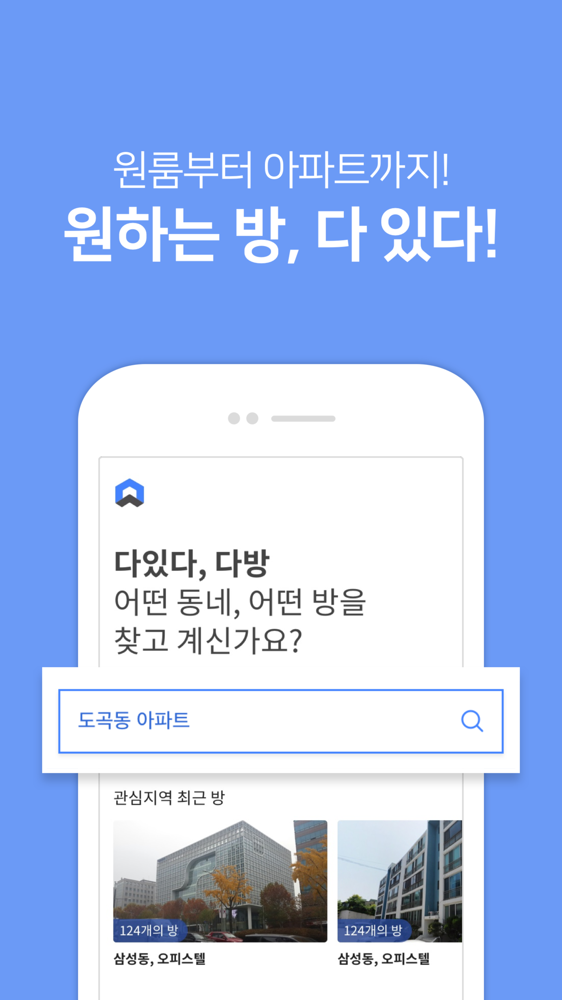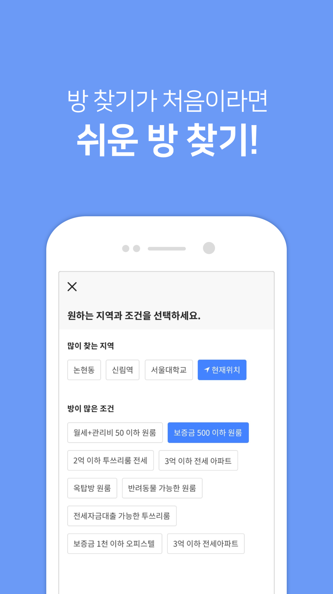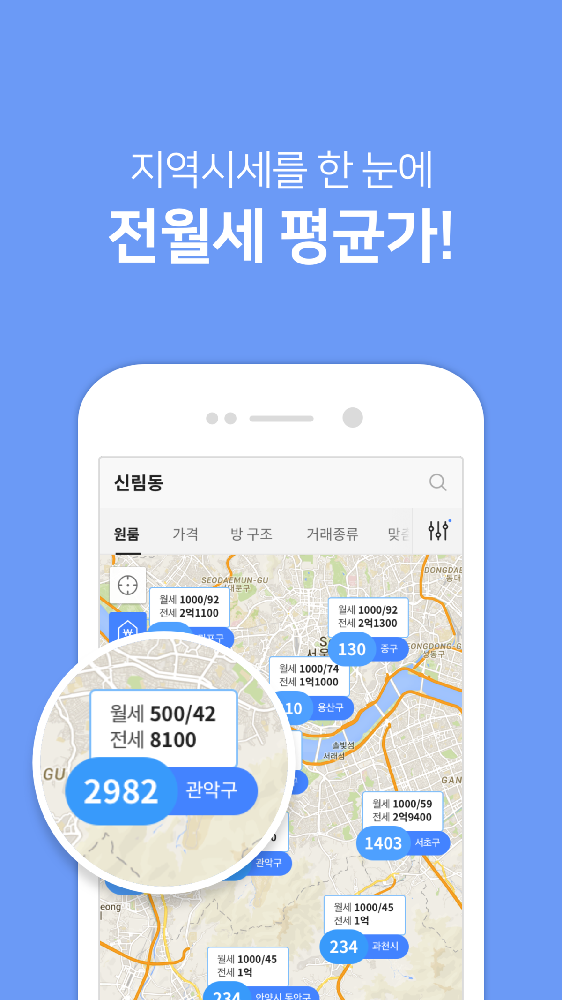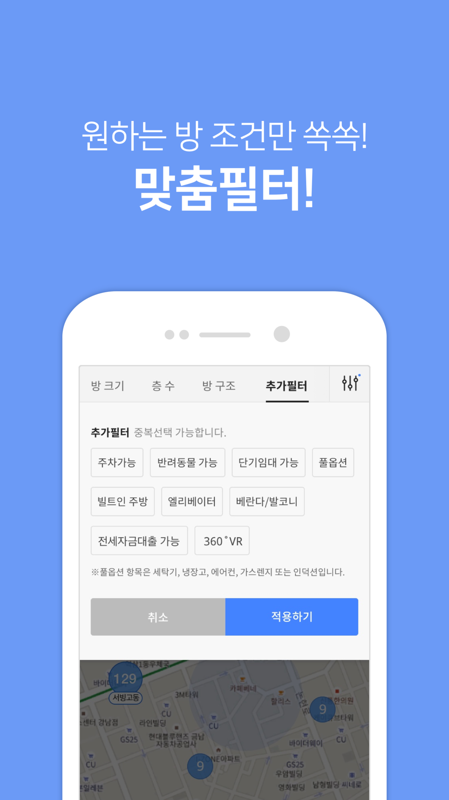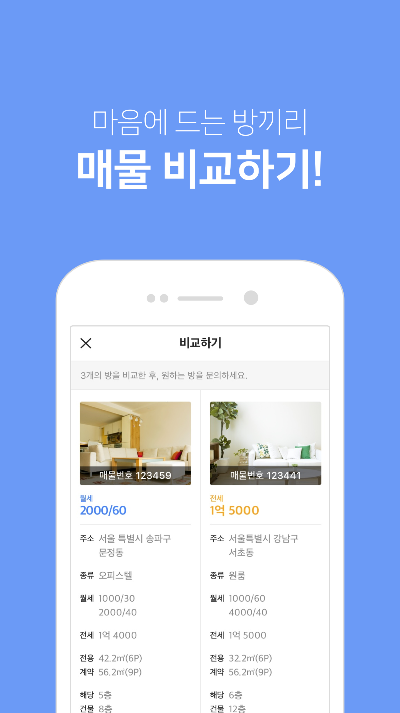

### 다방 단지 업데이트
* 소속 : Station3
* 역할 : 서버 개발
* 사용기술 : 상동 + 학군정보, 실거래가 등 데이터 수집
* 상세설명 : 단지 정보 추가에 따른 디비 설계 및 단지 관련 데이터 수집

### 다방 포토렉스
* 소속 : Station3
* 역할 서버 개발
* 사용기술 : SpringBoot, Postgresql, Hibernate, Spring-Data-Jpa, QueryDsl 등
* 상세설명 다방 단지에 필요한 단지, 평면도 사진 업로드를 위해 제작한 외주사 전용 서비스.

### 다방 프로
* 소속 : Station3
* 역할 : 서버 개발
* 사용기술 : SpringBoot, Postgresql, Mybaits, Swaggar 등
* 상세설명 : 중개사 전용 서비스인 다방 프로의 개발 및 등기부등본 조회를 통한 확인매물 서비스 개발 진행.

### 다방 방주인
* 소속 : Station3
* 역할 : 서버 개발
* 사용기술 : SpringBoot, Postgresql, Mybatis, restTemplate, Firebase 등
* 상세설명 : 임대인과 중개사를 연결해 임대인이 직접 방을 내놓을 수 있는 플랫폼 개발.

### 다방 어드민
* 소속 : Station3
* 역할 : 서버, 웹 개발
* 사용기술 : SpringBoot, SpringSecurity, Mybaits, React 등
* 상세셜명 : 다방 관리자 페이지, 스프링 시큐리티를 이용해 권한, 인증 관리.

## 개인 프로젝트 기여
### CoinPush Server & App

* 개인 프로젝트
* 비트코인 시세 변동 알림 애플리케이션
* 개발(20%) 운영(80%) 및 코인 도입, 기능 개선
* 관련기술 : NodeJs, ReactNative, Postgresql, socket-Io, Firebase, Heroku, Compose-Io

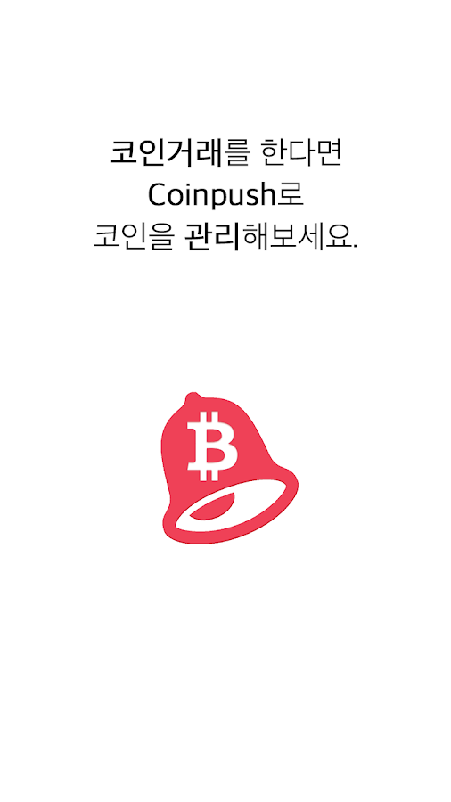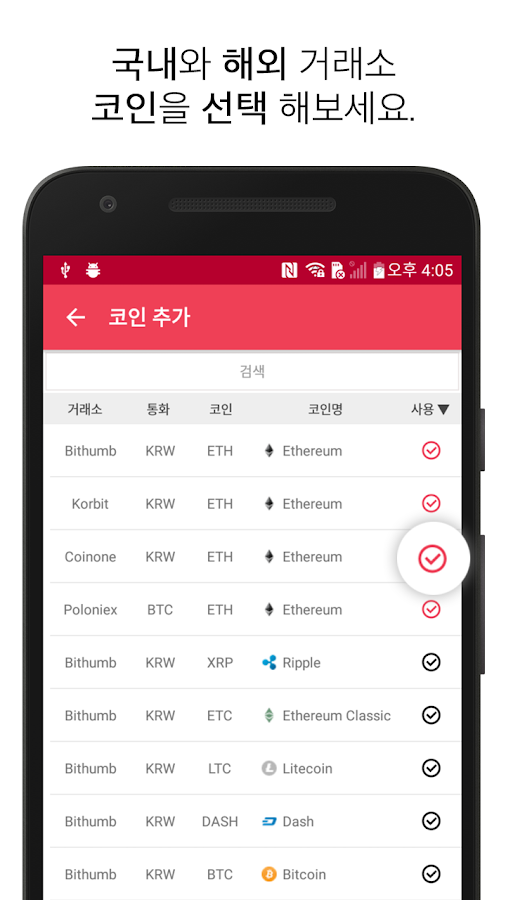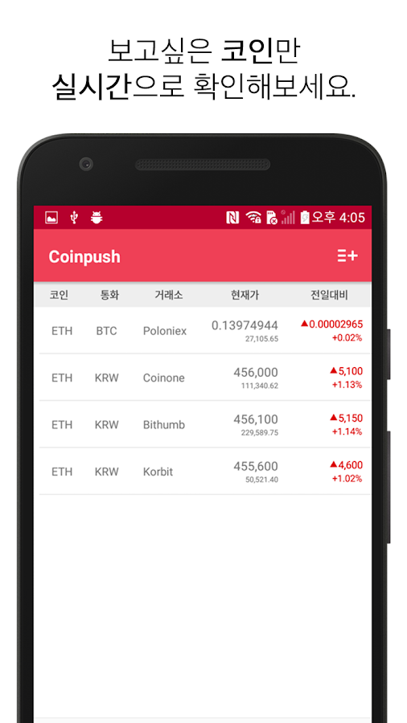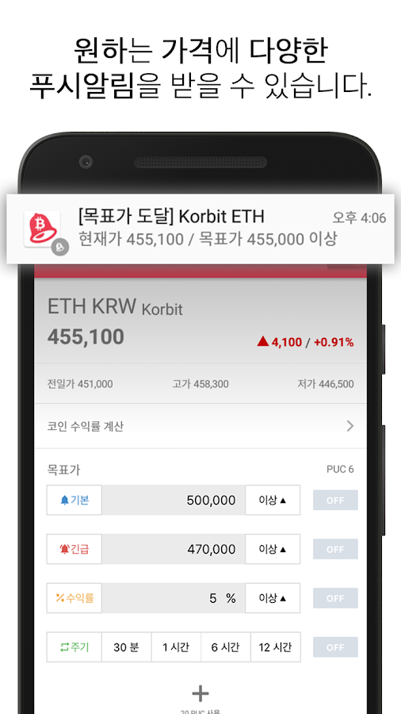

### Dust App (미세먼지)

* 팀 프로젝트
* 미세먼지 알림 애플리케이션
* 서버(100%) 서버운영(100%)
* 관련기술 : SpringBoot, EB, RDS, Postgresql, PostGis, Spring-Data-Jpa
* PlayStore(https://play.google.com/store/apps/details?id=com.ryoobk.dustdust&hl=ko)
* AppStore(https://itunes.apple.com/kr/app/dust/id1434796687?mt=8)

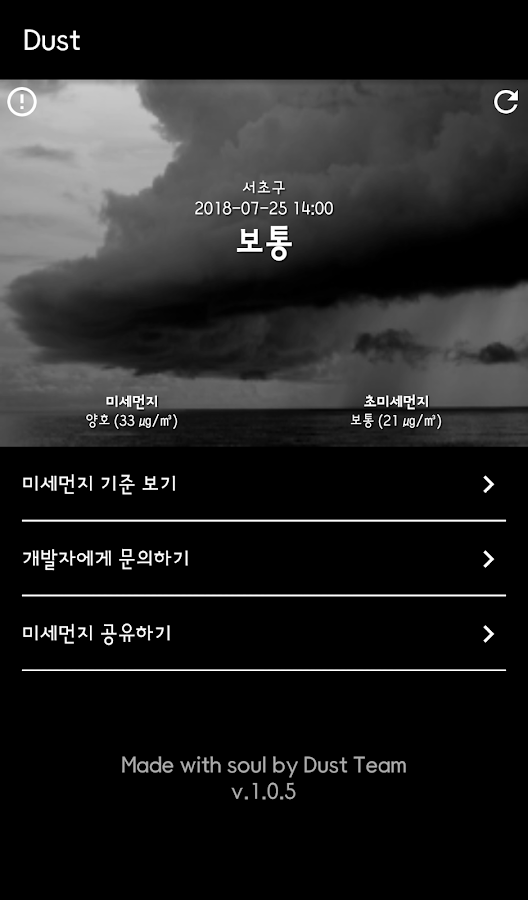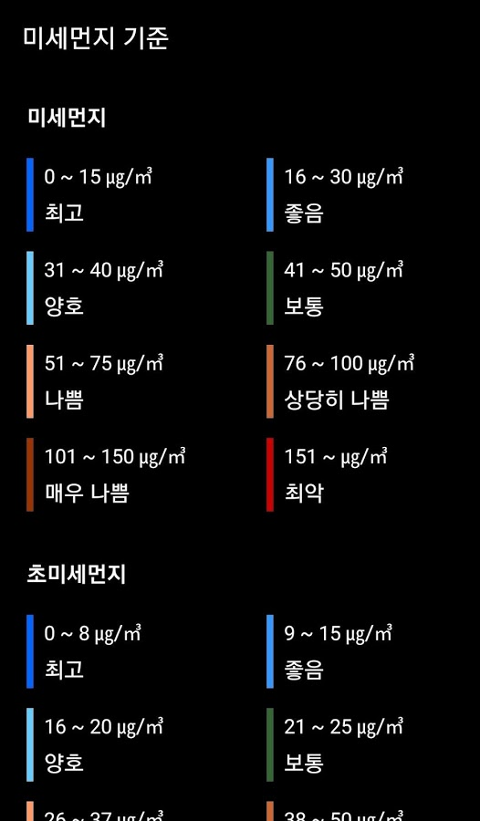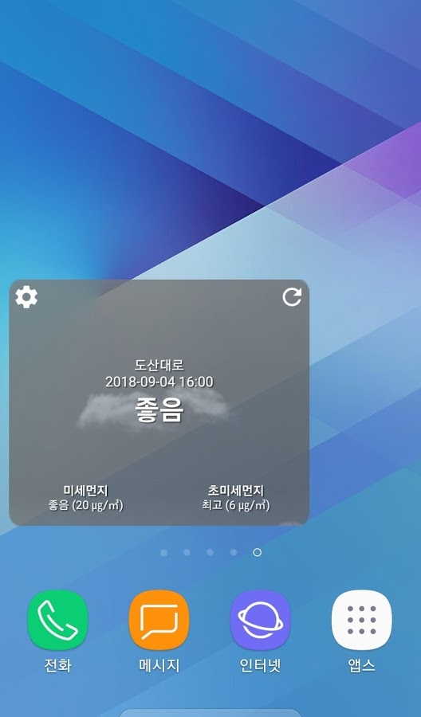

